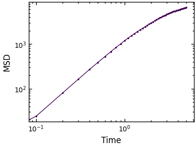
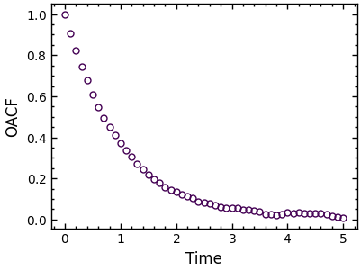
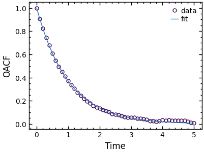
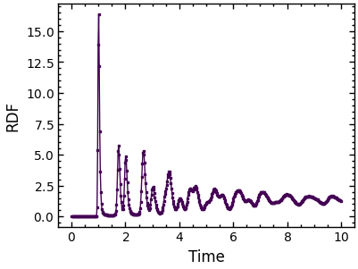
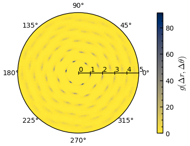
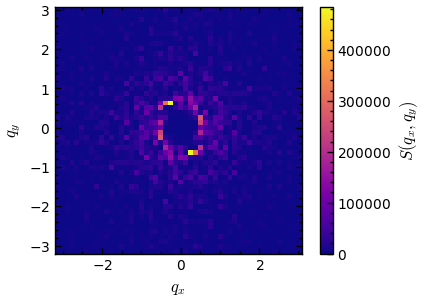
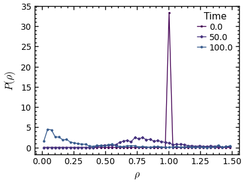
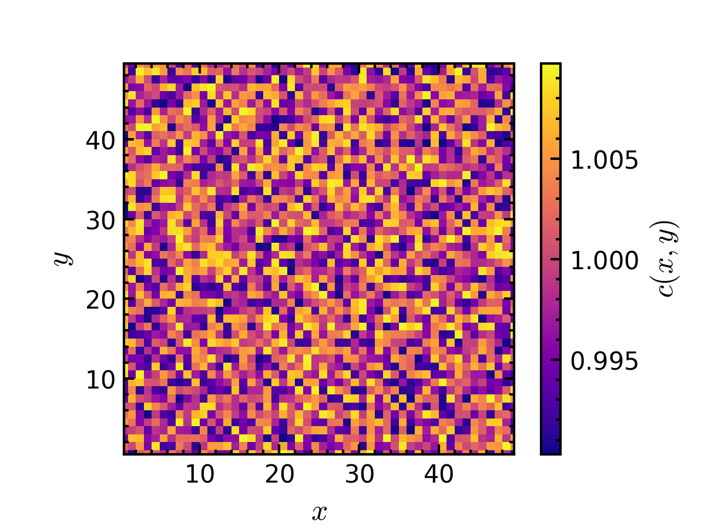

The following examples are an excerpt of the Jupyter examples notebook on GitHub. They serve as starting point for everyone who uses AMEP for the first time. The notebook and the data the examples are based on, are available on [https://github.com/amepproject/amep/tree/main/examples/](https://github.com/amepproject/amep/tree/main/examples/):

[Download data](https://download-directory.github.io/?url=https://github.com/amepproject/amep/tree/main/examples/data)

In the first example, we analyze simulation data from a LAMMPS simulation of active Brownian particles, in the second example of a continuum simulation of the Keller-Segel model for chemotaxis.


```python
import amep
```

# Example 1: Particle-based data (active Brownian particles)

First, we load the simulation data:


```python
# load simulation data (returns a ParticleTrajectory object)
traj = amep.load.traj(
    './data/lammps',
    mode = 'lammps',
    dumps = 'dump*.txt',
    # savedir = './data', # directory where to save the .h5amep file can be changed
    # trajfile = 'lammps.h5amep' # name of the saved trajectory file can be changed
)
```

## MSD: mean-square displacement
Now, let's start with a simple observable, the mean-square displacement (MSD)


```python
msd = amep.evaluate.MSD(traj, nav=None)
```

`nav`: number of averages
This will be important for values that are not time-dependent and should be averaged over multiple frames (= time steps). `nav=None` will take all frames of the trajectory.

And let's plot it:


```python
# create figure object
fig, axs = amep.plot.new()

# plot the MSD in a log-log plot
axs.plot(
    msd.times, # get time values of the analyzed frames
    msd.frames # get MSD at the analyzed frames
)

# axis labels for proper figure
axs.set_xlabel("Time")
axs.set_ylabel("MSD")
axs.loglog() # for typical display of MSD

# save figure as png
fig.savefig("./particles-msd-example.png")
```


    

    


## OACF: orientational autocorrelation function
Next, let's calculate the orientational autocorrelation function (OACF)


```python
oacf = amep.evaluate.OACF(traj, nav=None)
```


```python
fig, axs = amep.plot.new()

axs.plot(
    oacf.times,
    oacf.frames,
    'o', # adjust plot style
    ms=5,
    fillstyle="none"
)
axs.set_xlabel("Time")
axs.set_ylabel("OACF")

fig.savefig("./particles-oacf-example.png")
```


    

    


And, additionally, let's fit it:


```python
import numpy as np
# fit the OACF results
def f(t, tau=1.0):
    return np.exp(-t/tau)

fit = amep.functions.Fit(f)
fit.fit(oacf.times, oacf.frames)

print(f"Fit result: tau = {fit.params[0]:0.4f} +/- {fit.errors[0]:0.4f}")
```

    Fit result: tau = 1.0073 +/- 0.0055


Now, let's plot the data together with the fit:


```python
fig, axs = amep.plot.new()

axs.plot(
    oacf.times,
    oacf.frames,
    label="data",
    marker='o',
    ms=5,
    fillstyle="none",
    ls=""
)

# plot fit which can be generated via the `.generate()` function
axs.plot(
    oacf.times,
    fit.generate(oacf.times),
    label="fit",
    marker='',
    color='tab:blue',
    linestyle='-'
)

axs.set_xlabel("Time")
axs.set_ylabel("OACF")
axs.legend()

fig.savefig("./particles-oacf-fit-example.png")
```


    

    


Yes, our example simulation have $D_r=1$ in reduced units. The figure shows this good agreement.


## RDF: radial distribution function

Something a bit more interesting now, the radial distribution function. Still not the most difficult to calculate but one step at a time:


```python
# here we skip the first 80 % of the trajectory
# and do the calculation in parallel with 4 jobs to save some time
rdf = amep.evaluate.RDF(
    traj, nav = 10, skip = 0.8, 
    rmax = 10, # maximum distance
    njobs = 4
)
```


```python
fig, axs = amep.plot.new()

axs.plot(
    rdf.r, # we want the radial distance `r` instead of the time here
    rdf.avg, # and we access the averaged (`.avg`) result
)
axs.set_xlabel("Time")
axs.set_ylabel("RDF")

fig.savefig("./particles-rdf-example.png")
```


    

    


## PCFangle - angular pair correlation function

The radial distribution function already looks like the system is in a close packing configuration.
Let's check that with another observable, the angular pair correlation function $g(r,\theta)$.


```python
pcfangle = amep.evaluate.PCFangle(
    traj, nav = 5, skip = 0.9, 
    rmax = 5, # maximum distance
    njobs = 4
)
```


```python
fig, axs = amep.plot.new(subplot_kw=dict(projection="polar"))
mp = axs.pcolormesh(pcfangle.theta, pcfangle.r, pcfangle.avg, cmap="cividis_r")
cax = amep.plot.add_colorbar(fig, axs, mp, label=r"$g(\Delta r, \Delta \theta)$")

# making a simple radial axis
axs.set_rlabel_position(0)
axs.plot([0]*6,range(6), "|-k", ms=5)
axs.set_rticks(range(6))
axs.grid(False)

fig.savefig("./particles-pcfangle-example.png")
```


    

    


## Saving and loading results

Let us now save the results in separate HDF5 files:


```python
msd.save('./msd.h5')
oacf.save('./oacf.h5')
rdf.save('./rdf.h5')
```

Alternatively, you can save all results in one HDF5 file using AMEP's evaluation database feature:


```python
msd.save('./results-db.h5', database = True)
oacf.save('./results-db.h5', database = True)
rdf.save('./results-db.h5', database = True)
```

The results can later be loaded using the `amep.load.evaluation` function for further processing.


```python
msdloaded = amep.load.evaluation('./msd.h5')

# load all analysis data from the database file
results = amep.load.evaluation(
    './results-db.h5',
    database = True
)
# check which data is available within the loaded file
results.keys()
```


    ['msd', 'oacf', 'rdf']


## Animation feature

<!-- *Please be aware that you need FFmpeg to be installed for the full capabilities of this feature!* Without it, creating animations may take a long time. -->

Let's create a ``.gif`` so you know how to share your research on social media ;)


```python
traj.animate('./particles-animation.gif', xlabel=r'$x$', ylabel=r'$y$')
```


# Example 2: Continuum data (Keller-Segel model)

Let's have a look at continuum data.
In the example data, we have a short simulation of the Keller-Segel model in a parameter regime where the concentrations collapse.

Again, we first load the simulation data:


```python
# load simulation data (returns a FieldTrajectory object)
ctraj = amep.load.traj(
    './data/continuum',
    mode = 'field',
    dumps = 'field_*.txt',
    timestep = 0.01,
    # savedir = './data', # directory where to save the .h5amep file can be changed
    # trajfile = 'continuum.h5amep', # name of the saved trajectory file can be changed
    # reload=True # reload the simulation data even if a .h5amep trajectory file exists
)
```

Next, let us check which data is included within a frame of the trajectory file:


```python
ctraj[0].keys
```


    ['c', 'p']


Here, `'c'` denotes the chemical field and `'p'` the bacterial density. In the following, we will analyze the former.

## SF2d - 2D structure factor

Let's have a look at the 2d structure factor of the chemical field.


```python
fsf2d = amep.evaluate.SF2d(
    ctraj, skip = 0.1, 
    ftype = "c"
)
```


```python
fig, axs = amep.plot.new((5,3))
mp = amep.plot.field(
    axs, fsf2d.avg, fsf2d.qx, fsf2d.qy,
    # cscale="log", vmin=1e4 # if you want to plot in log scale
)
# mp.cmap.set_bad('k') # for log scale because S(q=0) is set to 0

# add colorbar and make plot nice
cax = amep.plot.add_colorbar(
    fig, axs, mp, label=r"$S(q_x, q_y)$"
)
axs.set_aspect("equal")
axs.set_xlabel(r'$q_x$')
axs.set_ylabel(r'$q_y$')

fig.savefig("continuum-sf2d-example.png")
```


    

    


## LDD - local density distribution

Next, we calculate and plot the local density distribution. Note that the following line is calculating the local density distribution for each frame within the trajectory. It is then averaging over all the results, i.e., it is performing a time average (`ldd.avg`). If the simulation is not in a steady state, one has be careful. Here, clearly not all frames are in the steady state. However, the results for each individual frame are still accessible (`ldd.frames`). We will use them here to plot the local density distribution for three different frames.


```python
ldd = amep.evaluate.LDdist(
    ctraj, nav = ctraj.nframes, ftype = 'c'
)
# ctraj.nframes returns the number of frames in the trajectory. None can also be used for `nav`. 
```


```python
fig, axs = amep.plot.new()

# plot the results for three different frames
axs.plot(ldd.ld, ldd.frames[0,0], label = ldd.times[0] )
axs.plot(ldd.ld, ldd.frames[5,0], label = ldd.times[5] )
axs.plot(ldd.ld, ldd.frames[-1,0], label = ldd.times[-1] )

# add legends and labels
axs.legend(title = 'Time')
axs.set_xlabel(r'$\rho$')
axs.set_ylabel(r'$P(\rho)$') # we denote the histogram result as P(\rho) here for simplicity of the plot

fig.savefig('./continuum-ldd-example.png')
```


    

    


And again, we can save the analysis results in an HDF5 file for subsequent loading without having to recompute the result.
This is more interesting for computations that take a longer time which we have not chosen for this examples notebook for obvious reasons.


```python
fsf2d.save("./fsf2d.h5")
ldd.save('./ldd.h5')
```

## Animation

We can create an animation of the trajectory just as we did with the particle-based data.


```python
ctraj.animate('./field-animation.gif', ftype='c', xlabel=r'$x$', ylabel=r'$y$', cbar_label=r'$c(x,y)$')
```




