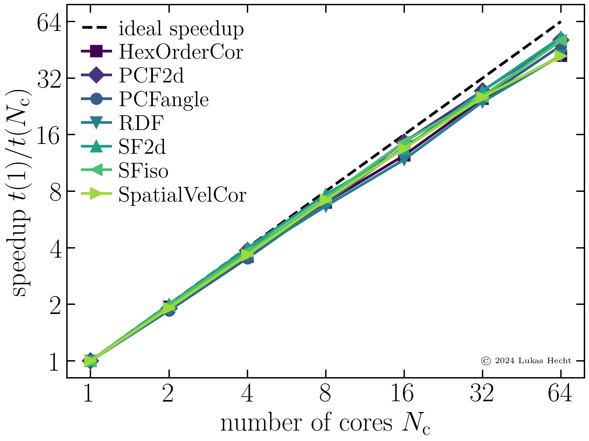

==========
Benchmarks
==========

---------------
Parallelization
---------------

Very complex and expensive computations are parallelized in AMEP to also run 
efficiently on high-performance computing hardware. The following table gives 
an overview on all observables that can be calculated in parallel with AMEP.

+---------------------------------------+---------------------------------+
| Observable:                           | AMEP evaluate object:           |
+=======================================+=================================+
| Hexagonal order correlation function  | ``amep.evaluate.HexOrderCor``   |
+---------------------------------------+---------------------------------+
| 2d pair correlation function          | ``amep.evaluate.PCF2d``         |
+---------------------------------------+---------------------------------+
| Angular pair correlation function     | ``amep.evaluate.PFCangle``      |
+---------------------------------------+---------------------------------+
| Radial pair distribution function     | ``amep.evaluate.RDF``           |
+---------------------------------------+---------------------------------+
| 2d static structure factor            | ``amep.evaluate.SF2d``          |
+---------------------------------------+---------------------------------+
| Isotropic static structure factor     | ``amep.evaluate.SFiso``         |
+---------------------------------------+---------------------------------+
| Spatial velocity correlation function | ``amep.evaluate.SpatialVelCor`` |
+---------------------------------------+---------------------------------+

The scaling shown in the image below was run with two Intel® Xeon® Platinum 
9242 Processors (96 cores in total) on the Lichtenberg high-performance 
computer at Technical University of Darmstadt. It is based on the total 
runtime for evaluating a Brownian dynamics simulation of 100,000 active 
Brownian particles done with LAMMPS.

